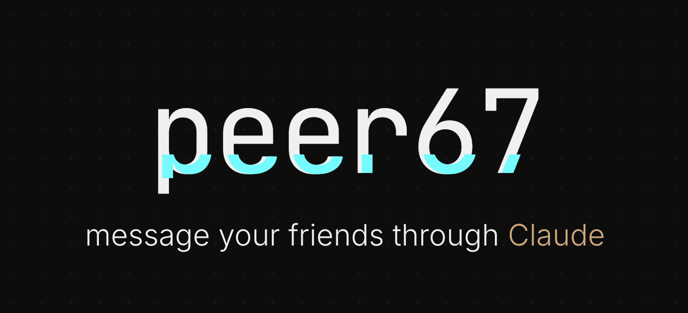

# Peer67



Encrypted ephemeral messaging for Claude Code — message your friends through your AI agent.

Two humans communicate through their Claude sessions. Messages are end-to-end encrypted — the relay stores only opaque blobs at hashed addresses. It never knows who is talking, what they're saying, or who the messages are for. Everything auto-deletes after 24 hours.

## How it works

```
You: "message Dana — the deck is ready"
Claude encrypts → relay stores blob → Dana's Claude decrypts
Dana: >> Suede (just now): "The deck is ready"
```

No accounts. No passwords. No metadata. Messages expire in 24 hours.

## Quick start

```bash
npm install -g peer67
peer67 setup
```

`peer67 setup` asks for your name and email, sends a verification link, and registers the MCP server with Claude Code automatically.

### Real-time mode (channels)

peer67 uses Claude Code [channels](https://code.claude.com/docs/en/channels) for real-time message push. Channels are in research preview — start Claude Code with:

```bash
claude --dangerously-load-development-channels server:peer67
```

Then start chatting:

```
> invite dana@example.com
> message Dana hey, are you free?

>> Dana (just now): "yeah, what's up?"
```

Messages push in real-time — no polling. Without the channel flag, peer67 still works but messages only appear when you explicitly check `/peer67:inbox`.

## Multiple identities

```bash
peer67 setup --profile work    # creates ~/.peer67-work + registers peer67-work MCP key
peer67 setup --profile dana    # creates ~/.peer67-dana + registers peer67-dana MCP key
```

Each profile gets its own isolated identity, key store, and MCP server entry.

## CLI commands

```
peer67 setup                    First-time setup (name + email + Claude config)
peer67 setup --profile <name>   Set up a second identity

peer67 register <email>         Register email for discovery
peer67 invite <email>           Invite someone by email (auto-connects if registered)
peer67 directory [search]       List registered users

peer67 connect <name>           Generate connection code
peer67 accept <name> <code>     Accept a connection code
peer67 complete                 Check if a pending connection completed

peer67 send <name> <message>    Send encrypted message
peer67 inbox [name]             Check messages
peer67 contacts                 List connections
peer67 status                   Show identity and connections

Options:
  --profile <name>              Use a separate identity
```

## Claude Code skills

Once set up, use these slash commands in Claude Code:

| Command | Description |
|---------|-------------|
| `/peer67:send <name> <message>` | Send an encrypted message |
| `/peer67:inbox` | Check for new messages |
| `/peer67:invite <email>` | Invite someone by email |
| `/peer67:contacts` | List connected contacts |
| `/peer67:directory [search]` | Browse registered users |
| `/peer67:chat <name>` | Start a chat session |
| `/peer67:requests` | View, accept, or decline connection requests |
| `/peer67:setup` | Set up identity via Claude |

Messages push in real-time via Claude Code channels. When a message arrives, it appears in your conversation instantly — no polling needed.

## Architecture

```
┌───────┐    ┌───────────┐    ┌─────────────┐    ┌───────────┐    ┌───────┐
│  You  │◄──►│   Claude   │◄──►│  peer67 MCP  │◄──►│   Relay    │◄──►│  ...  │
│       │    │  (your AI) │    │  (encrypt)   │    │  (blobs)   │    │       │
└───────┘    └───────────┘    └─────────────┘    └───────────┘    └───────┘
                                    │                   │               │
                               X25519 + AES      Zero-knowledge    Friend's
                               key exchange       dead-drop        peer67 MCP
```

- **Relay** — a dumb key-value store. Holds encrypted blobs at hashed addresses. No users, no auth, no logs. 24h TTL.
- **MCP Server** — runs as a Claude Code subprocess. Handles key exchange (X25519), encryption (AES-256-GCM), and local connection storage.
- **Connection codes** — encode an X25519 public key + relay URL. Share out-of-band. One-time use.
- **Two mailboxes per connection** — each direction gets its own address. The relay cannot link them.
- **Discovery layer** — optional email registration (`/r/*` endpoints). Register to be findable; invite by email auto-connects if the recipient is already registered.
- **Real-time push** — uses Claude Code channels (`notifications/claude/channel`) for instant message delivery. SSE subscription to the relay triggers channel notifications that appear directly in your conversation.

## Security

- **Zero-knowledge relay** — stores only encrypted blobs at hashed addresses
- **No metadata** — no users, no accounts, no sender/recipient fields, no logs
- **End-to-end encryption** — AES-256-GCM with keys derived via X25519 + HKDF-SHA256
- **Ephemeral** — 24h auto-delete, no permanent storage
- **No correlation** — separate mailbox IDs per direction prevent linking sender and recipient
- **AAD binding** — ciphertext is bound to its destination mailbox, preventing replay attacks

## Self-host a relay

```bash
docker compose up -d
```

Or deploy the `relay/` directory anywhere that runs Node.js + Redis. Set `REDIS_URL` and you're done.

The default relay is `relay.peer67.com`. Override per-connection or in `~/.peer67/config.json`.

## Protocol

See [protocol/PROTOCOL.md](protocol/PROTOCOL.md) for the full specification.

## License

MIT — [github.com/yuvalsuede/peer67](https://github.com/yuvalsuede/peer67)
